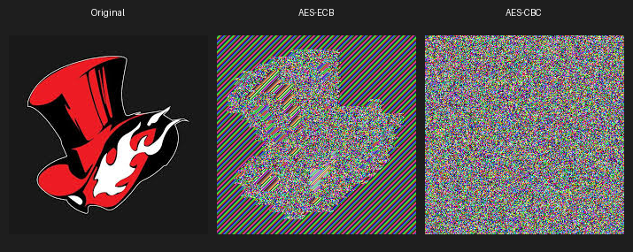

# Laboratorio 3 Block Cipher

Laboratorio de criptografía que implementa y analiza cifrados de bloque usando los algoritmos DES, 3DES y AES con distintos modos de operación (ECB, CBC). Incluye demostración visual de la vulnerabilidad de ECB mediante cifrado de imágenes.

---

## Estructura del proyecto

```
BLOCK/
├── images/
│   ├── original.png
│   ├── aes_ecb.png
│   ├── aes_cbc.png
│   └── comparison.png
├── src/
│   ├── des_cipher.py
│   ├── tripledes_cipher.py
│   ├── aes_cipher.py
│   └── utils.py
├── tests/
│   └── test.py
├── requirements.txt
└── README.md
```

---

## Instalación

**Requisitos:** Python 3.8 o superior.

```bash
# 1. Clonar el repositorio
git clone https://github.com/tu-usuario/tu-repo.git
cd tu-repo

# 2. Instalar dependencias
pip install -r requirements.txt
```

---

## Ejecución

```bash
cd tests
python test.py
```

> Antes de ejecutar, asegúrate de tener una imagen `original.png` dentro de la carpeta `images/`. Se recomienda una imagen con áreas de color uniforme o un logo para que la diferencia ECB vs CBC sea más evidente.

---

## Análisis de Seguridad

### 2.1 Tamaños de clave

| Algoritmo | Bytes | Bits |
|-----------|-------|------|
| DES       | 8     | 64   |
| 3DES      | 16    | 128  |
| AES-256   | 32    | 256  |

**¿Por qué DES se considera inseguro hoy en día?**

DES utiliza una clave efectiva de 56 bits (los otros 8 bits del bloque de 64 se usan para paridad). Con el poder de cómputo moderno, especialmente usando GPUs o hardware especializado como FPGAs, es posible recorrer todo el espacio de claves mediante fuerza bruta en un tiempo relativamente corto.

**Tiempo estimado para un ataque de fuerza bruta (GPU ~10⁹ claves/seg):**

| Algoritmo | Espacio | Tiempo estimado | Estado     |
|-----------|---------|-----------------|------------|
| DES       | 2^56    | ~1.14 años      | ROMPIBLE   |
| 3DES      | 2^112   | ~8.23×10¹⁶ años | Seguro     |
| AES-256   | 2^256   | ~1.83×10⁶⁰ años | Seguro     |

---

### 2.2 Comparación de modos de operación

| Algoritmo | Modo de operación |
|-----------|-------------------|
| DES       | ECB               |
| 3DES      | CBC               |
| AES       | ECB y CBC         |

**¿Cuáles son las diferencias fundamentales entre ECB y CBC?**

**ECB (Electronic Codebook):** cada bloque se cifra de manera independiente con la misma clave. Bloques de plaintext idénticos siempre producen el mismo ciphertext.

**CBC (Cipher Block Chaining):** cada bloque de plaintext se combina mediante XOR con el bloque cifrado anterior antes de cifrarse. Esto crea una dependencia entre bloques, eliminando los patrones.

**¿Se puede notar la diferencia en una imagen?**

Sí. Al cifrar una imagen con ECB los patrones visuales originales siguen siendo distinguibles, porque bloques de píxeles iguales generan bloques cifrados iguales. Con CBC la salida parece completamente aleatoria ya que cada bloque depende del anterior y del IV.

**Comparación visual:**



---

### 2.3 Vulnerabilidad de ECB

ECB es inseguro para datos sensibles porque cifra cada bloque de forma independiente, lo que provoca que bloques de plaintext idénticos produzcan exactamente el mismo bloque cifrado. Los patrones del mensaje original permanecen visibles en el ciphertext sin necesidad de conocer la clave.

**Experimento con mensaje repetido:**

Mensaje: `'ATAQUE ATAQUE !!ATAQUE ATAQUE !!ATAQUE ATAQUE !!'` (3 bloques de 16 bytes idénticos)

| Bloque | ECB (hex)                        | CBC (hex)                        | ECB repite? |
|--------|----------------------------------|----------------------------------|-------------|
| 1      | 7fc30a09608b6fe9d0ab0dfbccf207bc | 70d7b06807e1d9e6925a5738542da44a | Ref.        |
| 2      | 7fc30a09608b6fe9d0ab0dfbccf207bc | 589ca72aba1ee33c5c6bfbf22037f931 | SI ← peligro|
| 3      | 7fc30a09608b6fe9d0ab0dfbccf207bc | a4b3099481f1a80006e6664d97a95371 | SI ← peligro|

Los 3 bloques ECB son idénticos. Los 3 bloques CBC son completamente distintos.

---

### 2.4 Vector de Inicialización (IV)

El IV es un valor aleatorio que se combina con el primer bloque del mensaje antes del cifrado en CBC. Su función es garantizar que dos mensajes iguales cifrados con la misma clave produzcan resultados distintos.

ECB no usa IV porque cada bloque se cifra de forma independiente, lo cual es precisamente una de las razones por las que es menos seguro.

**Experimento:**

*Experimento 1 — Mismo IV:*
```
IV:       764e5723526aaed860cb685eb90ab1b5
Cifrado A: 4191dfbe1f1e78d69f140b139d41c6d7...
Cifrado B: 4191dfbe1f1e78d69f140b139d41c6d7...
Resultado: IDENTICOS
```

*Experimento 2 — IVs distintos:*
```
IV-A:     5dd3f9ac9210186b75c512c6175341c0
IV-B:     5dcfe92f87c146a0a0c0c2e127f9a00b
Cifrado A: 4720fd14db97fcca8331d014438e40e5...
Cifrado B: f45b4caa1f28a386fd5765cc6ab8126d...
Resultado: DISTINTOS
```

**¿Qué pasaría si un atacante intercepta mensajes con el mismo IV?**

Si se reutiliza el mismo IV, un atacante podría detectar patrones entre mensajes cifrados, inferir cuándo dos mensajes comienzan con el mismo contenido, y en algunos casos facilitar ataques de texto plano conocido mediante XOR entre ciphertexts.

---

### 2.5 Padding

El padding es el proceso de agregar bytes adicionales a un mensaje para que su longitud sea múltiplo del tamaño de bloque del algoritmo. DES trabaja con bloques de 8 bytes; si el mensaje no llena el último bloque completamente, se agrega padding.

**Resultados de `pkcs7_pad` con diferentes mensajes:**

*Mensaje de 5 bytes — `b'Hola!'`:*
```
Original   ( 5B): 486f6c6121
Con padding( 8B): 486f6c6121030303
Padding: 3 × 0x03
```
Se agregaron 3 bytes con valor `0x03`, indicando que hacían falta 3 bytes para completar el bloque.

*Mensaje de 8 bytes — `b'12345678'` (bloque exacto):*
```
Original   ( 8B): 3132333435363738
Con padding(16B): 31323334353637380808080808080808
Padding: 8 × 0x08
```
Caso especial: aunque el mensaje ya ocupa un bloque completo, PKCS#7 obliga a agregar un bloque adicional entero con valor `0x08` para poder distinguir padding de datos reales al descifrar.

*Mensaje de 10 bytes — `b'Hola mundo'`:*
```
Original   (10B): 486f6c61206d756e646f
Con padding(16B): 486f6c61206d756e646f060606060606
Padding: 6 × 0x06
```
Se agregaron 6 bytes con valor `0x06` para completar el bloque de 16 bytes.

`pkcs7_unpad` recupera correctamente el mensaje original en los 3 casos.

---

### 2.6 Recomendaciones de uso

| Modo | Descripción | Casos de uso recomendados | Desventajas |
|------|-------------|---------------------------|-------------|
| ECB  | Cifra cada bloque independientemente | No recomendado en producción | Filtra patrones, completamente inseguro |
| CBC  | Cada bloque depende del anterior | Archivos cifrados, almacenamiento en disco | Requiere IV y padding; no paralelizable |
| CTR  | Convierte el cifrado de bloque en flujo | Alto rendimiento, transmisión en red | Requiere manejo correcto del nonce |
| GCM  | Cifrado autenticado (AEAD) | Comunicaciones seguras modernas (TLS, HTTPS) | Requiere nonce único por mensaje |

**Código de ejemplo en Python (AES-GCM):**

```python
from Crypto.Cipher import AES
from Crypto.Random import get_random_bytes

key = get_random_bytes(32)
cipher = AES.new(key, AES.MODE_GCM)
ciphertext, tag = cipher.encrypt_and_digest(b"mensaje secreto")
```

**Código de ejemplo en JavaScript / Node.js (AES-GCM):**

```javascript
const crypto = require("crypto");
const key = crypto.randomBytes(32);
const iv = crypto.randomBytes(12);
const cipher = crypto.createCipheriv("aes-256-gcm", key, iv);
let encrypted = cipher.update("mensaje secreto", "utf8", "hex");
encrypted += cipher.final("hex");
```

**Modos AEAD**

Los modos AEAD (Authenticated Encryption with Associated Data) proporcionan confidencialidad e integridad al mismo tiempo. GCM es el ejemplo más usado, presente en protocolos modernos como TLS 1.3. Además del cifrado genera una authentication tag que permite verificar que los datos no fueron modificados durante la transmisión, algo que CBC y CTR por sí solos no garantizan.
